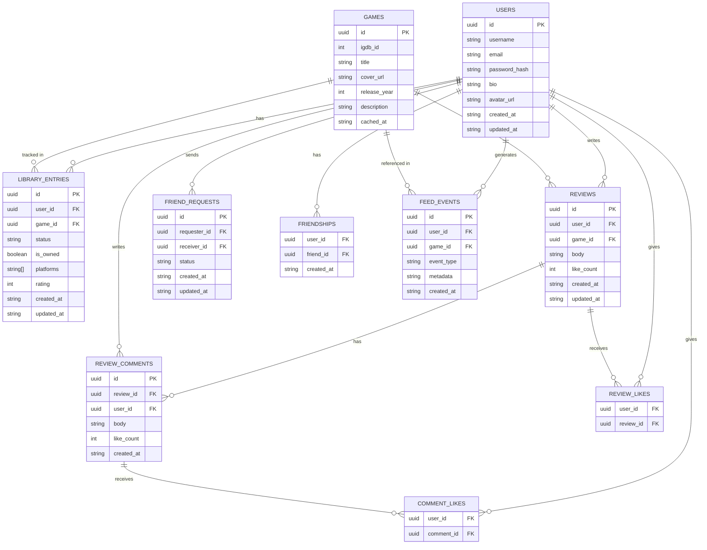
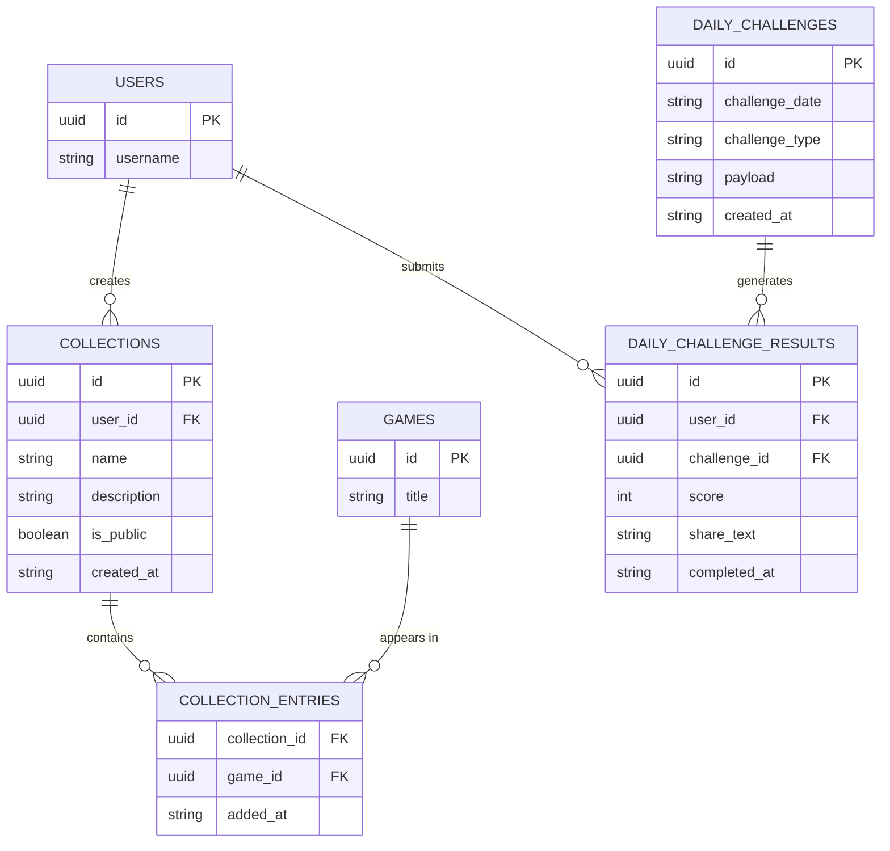

# LevelUp — Product Design Document

**Version:** 2.0
**Status:** Pre-development — Design phase
**Frontend:** Angular / TypeScript
**Backend:** Spring Boot / Java
**Database:** PostgreSQL
**Author:** Stone Killen

---

## Table of Contents

1. [Project Overview](#1-project-overview)
2. [Goals & Non-Goals](#2-goals--non-goals)
3. [Target Audience](#3-target-audience)
4. [Design Philosophy](#4-design-philosophy)
5. [Features](#5-features)
6. [User Stories](#6-user-stories)
7. [System Architecture](#7-system-architecture)
8. [Angular Component Tree](#8-angular-component-tree)
9. [Data Model](#9-data-model)
10. [Entity Relationship Diagram](#10-entity-relationship-diagram)
11. [Phased Roadmap](#11-phased-roadmap)
12. [UI Design Direction](#12-ui-design-direction)
13. [Open Questions](#13-open-questions)

---

## 1. Project Overview

### What is LevelUp?

LevelUp is a social game library and tracking application built for anyone who plays video games — from dedicated hobbyists to casual players. It gives users a personal, expressive space to track the games they own, have played, and want to play, while making that information visible to friends in a meaningful way.

### The Problem  

Existing tools fall into the following issues:  

- **Cataloguing apps** (Backloggd) are built for enthusiasts who want a database. They feel like spreadsheets with a social layer bolted on. They do not attract casual players and the social features feel secondary.
- **Letterboxd** proved that a logging app can have genuine cultural appeal — but it is built around a passive medium. Games are longer, more varied, more social, and have a fundamentally different relationship with the player. That richness deserves a more expressive tool.
- **Platform Differences** People own games on different platforms and there is not an easy way to view what friends own on
different platforms without having to check their profile on each platform.  

Neither app answers two main questions:  
**What games do my friends own that I could play with them**
**What should I play next**

### Why Angular + Spring Boot?

This project is intentionally built with Angular and Spring Boot to develop and demonstrate full-stack competency in an enterprise-relevant stack. Angular is chosen for the frontend specifically — this project is a learning vehicle for Angular as much as it is a portfolio piece. Spring Boot was chosen as I have previous Java knowledge and want to expand my skillset to more enterprise toolings.

---

## 2. Goals & Non-Goals

### Primary Goals

1. Give users a clean, expressive space to catalogue their game library with nuanced status tracking
2. Make friends' libraries and wishlists visible so co-op sessions and gift-giving are effortless
3. Create a social feed that feels alive without requiring heavy content creation from users
4. Build an experience that appeals to people who may not normally be interested in cataloguing applications
5. Include a daily challenge feature that gives users a reason to return even when they have nothing to log
6. Make the app feel fun — not like a chore — through personality in the UI, expressive interactions, and a conversational "what to play next" flow
7. Serve as a strong portfolio project demonstrating full-stack Angular + Spring Boot competency

### Secondary Goals

1. Support game discovery through taste-matched friend recommendations and a rich discovery feed
2. Provide a public-facing landing experience compelling enough to convert logged-out visitors into signups
3. Lay a data model foundation that supports future features without requiring breaking changes

### Non-Goals (V1)

The following are explicitly out of scope for the initial version:

- Real-time chat or messaging between users
- Direct API integration with Steam, PSN, or Xbox (manual library management in V1)
- Mobile native application — responsive web only
- Monetisation features of any kind
- Moderation tooling beyond basic reporting

---

## 3. Target Audience

LevelUp is intentionally designed to avoid "gamer" framing. The word does not appear in the UI. The app is for anyone who plays games.

| User Type | Description |
| --- | --- |
| Completionists | Tracks everything meticulously, cares about stats and completion, wants their profile to reflect their history accurately |
| Social Players | Primarily plays with friends, wants to coordinate sessions, see shared libraries, and stay connected to what friends are playing |
| Casual Enjoyers | Plays Stardew Valley, Mario Kart, mobile games, sports games. Does not identify as a gamer. Drawn in by the social and wishlist features |
| Discoverers | Wants to find new games. Trusts their friends' opinions over any algorithm or review aggregate site |

The daily challenge feature is specifically designed with the casual player in mind — it must be engaging and fair to someone who only play casually, not just to encyclopedic game enthusiasts.

---

## 4. Design Philosophy

### Identity over stats  

A profile should express taste and history, not just numbers. The goal is a profile that feels like a record collection — something you want to look at and share — not a database printout.

### Low friction first  

Logging should take seconds. The most common interaction in the app is adding a game or changing a status. That flow should be so fast it becomes a habit.

### Social by default

The value of the app multiplies with every friend on the platform. Social features are first-class, not afterthoughts. A user with zero friends should still find value, but a user with five friends should find dramatically more.

### Fun as a design requirement

The application is about games. It should feel like it. The "what to play next" feature should feel conversational, not like a filter form. The daily challenge should feel like a small event. UI copy should have personality. Small moments of delight matter.

### Inclusive language

The word "gamer" is never used in the UI. The app speaks to anyone who plays games without assuming identity, platform preference, or level of investment.

### Richness over time

Like a journal, the app becomes more emotionally valuable the longer you use it. A profile with three years of history tells a story. This is the core retention mechanic — not points or badges, but the accumulating personal value of a well-maintained library and history.

### Scalability

Create a platform that can grow with user input, while built for a portfolio if the platform is published and can grow into something users want and enjoy then the platform should be able to easliy scale to meet user demand and add features that users want

### User Experience

User experience is at the forefront for design, while ensuring that the platform feels "fun" to users there is a need to adjust to what Users want.  

---

## 5. Features

### 5.1 Game Library & Status Tracking

Users can add any game to their library and assign it a play status. Owned is a separate boolean flag — it is not a status. This allows a game to be "Owned + Playing" or "Owned + Finished" rather than forcing a choice between them.

#### **Owned flag**

A boolean toggle independent of play status. Answers the social question "does my friend have this game." A game can be owned with any status, or not owned at all (e.g. played at a friend's house).

#### **Play statuses**

| Status | Meaning |
| --- | --- |
| Wishlist | Want to play or own — does not imply ownership |
| Backlog | Owned, haven't meaningfully started, intend to play |
| Playing | Currently in an active playthrough |
| Played | Have played it — no completion claim, does not imply ownership |
| Finished | Reached the credits / completed the main story |
| Completed | 100% — all achievements, side content, everything the game offers |
| Abandoned | Started and stopped — not planning to return |

#### **Additional library fields per game entry:**

- Platforms owned on (PC, PS5, Xbox, Switch, etc.) — stored as an array, supports multiple platforms per entry
- Personal rating (1–10) stored on the library entry, independent of whether a review exists
- Date added
- Date status last changed

---

### 5.2 Reviews & Social Engagement

Users can write a review for any game they have in their library. Reviews are the primary content unit of the social layer.

#### **Review features:**

- Review body (text) is required — a review is a deliberate written piece. Posting a review is optional, but if you post one it must contain text
- Rating (1–10) lives on the library entry, not the review — a user can rate without reviewing. The review response includes the author's rating by reading it from their library entry
- When writing a review, the form pre-populates with the user's existing rating and saving the review updates that same library entry rating field — one source of truth, two ways to set it
- Standalone rating without text is handled via the library entry, not through the review system
- Reviews can be liked by other users
- Reviews support flat comments (one level deep — no threading in V1)
- Comments can be liked
- Reviews are visible on the game's page, sorted by friend activity first then by recency
- A user's reviews are visible on their profile

**Design note on length:** Reviews are short-form by design. There is no hard character limit but the UI is designed to encourage concise takes. Long-form reviews are supported but not the primary use case.

---

### 5.3 Friends & Social Visibility

The social core of the application. Friend relationships are mutual — both users must accept before library access is granted.

#### **Friend features:**

- Search for users by username
- Send, accept, and decline friend requests
- Friends-only library visibility — a user's full library is only visible to confirmed friends
- Visibility to friend's game platform profiles
- Browse a friend's library with filter and sort controls
- **Shared library view** — "games we both own" automatically intersects two libraries filtered by the Owned flag
- Wishlist visibility to friends — enables organic gift radar behaviour
- Friend activity visible in the social feed

---

### 5.4 Discovery Feed

The discovery feed is the primary logged-in home screen experience and also the primary public-facing surface for logged-out visitors.

**Logged-out experience:**
The landing page shows trending games, recent community activity (anonymised), and application feature highlights. This is the acquisition surface — it needs to communicate the value of the app clearly enough to convert visitors to signups.

**Logged-in feed views — user can switch between:**

| Feed | Content |
| --- | --- |
| Trending | Most logged, rated, and reviewed games across the platform right now |
| Friends | Activity from confirmed friends — status changes, completions, new reviews |
| For You | Personalised recommendations based on the user's taste profile |
| Similar to games you've played | Games sharing genre, tags, or metadata with highly-rated games in the user's library |
| New & Notable | Recently released games with strong early community ratings |

**Recommendation logic for "For You":**

- Based on the user's top genres derived from rated and completed games
- Weighted toward genres the user engages with most
- Excludes games already in the user's library
- Boosted by friend activity — if multiple friends rated a game highly it surfaces higher
- Excludes platform exclusives for platforms the user has not marked as owned

---

### 5.5 What to Play Next

A conversational feature that helps users decide what to play from their backlog or suggests something new. The interaction is designed to feel like asking a knowledgeable friend, not filling out a filter form.

**User inputs (presented conversationally, not as dropdowns):**

- What platform do you want to play on? (PC / PlayStation / Xbox / Switch / any)
- How much time do you have? (under 1 hour / a few hours / all day)
- What mood are you in? (chill / story / challenge / social / something new)
- Play with others or solo?
- Should we include games you've already played?

**Output:**
The feature returns a ranked shortlist of 3–5 games. Results pull from:

1. The user's Backlog first
2. Games owned but with no status (Owned flag, no play status)
3. New suggestions not in the library if the user opted in

The result is presented with a brief explanation for each suggestion — "Because you finished Red Dead Redemption 2 and rated it 9/10" — not just a list.
Backlog is listed first to show user that they already own a game that fits their criteria

---

### 5.6 Custom Collections

Beyond the default statuses, users can create named custom collections — curated lists of games that mean something to them.

- Create a collection with a name and optional description
- Add any game to a collection regardless of library status
- Collections are private by default with a toggle to make them public
- Public collections have a shareable link
- Collections appear on the user's profile
- Examples: "Games I finished with my partner", "Perfect rainy day games", "Games that made me feel something"

---

### 5.7 Taste Profile

Each user has a taste profile derived from their rated and completed games. This is not a reccomendation mechanic — it is a genuine reflection of the user's history that becomes more accurate and interesting over time.
Provides metrics for the user to better understand their collection

**Profile components:**

- Genre breakdown (visual distribution of genres in rated/completed games)
- Top tags (recurring descriptors across liked games — "open world", "narrative", "couch co-op")
- Favourite platforms ( All time favorite platform as well as current platform )
- Play style tendencies (solo vs multiplayer, short vs long games, etc.)

**Friend compatibility:**
When viewing a friend's profile, a compatibility indicator is shown based on genre and tag overlap. This is a conversation starter, not a score — framed as "you both love narrative games" rather than "73% compatible."

**Onboarding use:**
During onboarding, new users are walked through a quick preference flow — shown games and asked if they've played them and what they thought. This seeds the taste profile immediately so the discovery feed is useful from day one rather than empty.

---

### 5.8 Daily Challenge

#### **Mechanic: Odd One Out**

The daily challenge is a core retention feature. The mechanic is a two-phase puzzle that requires no deep game knowledge — only gaming intuition and general awareness.

**Phase 1 — Four rounds of odd-one-out:**
Each round presents four games. Three share a hidden connection; one does not belong. The user picks the odd one out. Four rounds total, one odd-one-out per round.

**Phase 2 — Find the pattern:**
The four "odd" games collected across the four rounds are themselves connected by a single theme. The user must identify what those four games have in common.

Scoring rewards both accuracy and confidence — getting Phase 2 correct after fewer wrong guesses scores higher. The connection categories are designed to work on vibes and general gaming awareness, not encyclopedic knowledge. A casual player who only plays sports games and a hardcore RPG fan should both have a reasonable chance. Its purpose is to give users a reason to open the app every day regardless of whether they have anything to log.

**Non-negotiable requirements regardless of final mechanic:**

- One attempt per day — time-gated, cannot be farmed in a single session
- Accessible to the full audience spectrum — must be fair and fun for a casual player who only plays sports games or party games, not just encyclopedic game enthusiasts
- No deep game knowledge required — opinion, intuition, and general gaming culture are valid paths to a good score
- Has a reveal and score moment at the end of each attempt
- Score is recorded on the user's profile with a visible history
- Friend scores for the same day are visible after completion — social comparison is the hook
- Result is shareable as a text snippet (Wordle-style) — organic acquisition channel
- The mechanic must feel native to a game tracking app — it should not feel like a minigame bolted on from a different product
- Daily challenge data (answers, scores over time) should feed back into the taste profile or otherwise connect to the core app features

**Profile display:**

- Current streak and longest streak
- Score history shown as a compact calendar heatmap on the profile
- Daily challenge leaderboard among friends (today's scores, visible after completion)

---

## 6. User Stories

### Authentication & Onboarding

| ID | As a... | I want to... | So that... |
| --- | --- | --- | --- |
| US-01 | New user | create an account with email and password | I can access my personal library |
| US-02 | New user | go through an onboarding flow that lets me search and add games I've played | my profile and taste profile are seeded from day one |
| US-03 | New user | indicate my preferences and favourite genres during onboarding | my discovery feed is relevant immediately |
| US-04 | Returning user | log in and land on my discovery feed | I can pick up where I left off |
| US-05 | User | reset my password via email | I can recover my account |
| US-06 | Logged-out visitor | browse trending games and see community activity on the landing page | I understand the value of the app before signing up |

### Library Management

| ID | As a... | I want to... | So that... |
| --- | --- | --- | --- |
| US-07 | User | search for any game by title and add it to my library | I can start tracking it |
| US-08 | User | assign a play status to a game in my library | my library accurately reflects my relationship with each game |
| US-09 | User | toggle the Owned flag on any game independently of its status | my friends can see what I own regardless of whether I've played it |
| US-10 | User | change a game's status at any time | my library stays current |
| US-11 | User | tag which platform I own or played a game on | my library reflects my actual setup |
| US-12 | User | add a game to my Wishlist | I can track what I want to play or own |
| US-13 | User | rate a game from 1–10 | I have a personal record of how much I enjoyed it |
| US-14 | User | write an optional review for any game in my library | I can record my thoughts and share them with the community |
| US-15 | User | create a custom collection and add games to it | I can curate meaningful lists beyond default statuses |
| US-16 | User | make a collection public and share a link | others can discover and enjoy my curated list |

### Social & Friends

| ID | As a... | I want to... | So that... |
| --- | --- | --- | --- |
| US-17 | User | search for other users and send friend requests | I can connect with people I know |
| US-18 | User | accept or decline incoming friend requests | I control who can see my library |
| US-19 | User | browse a friend's full library | I can see what they own and have played |
| US-20 | User | see a view of games both me and a friend have marked as Owned | we can quickly find what to play together |
| US-21 | User | see a friend's wishlist | I know what to get them as a gift |
| US-22 | User | see an activity feed of what my friends are doing | I stay connected to their gaming life |
| US-23 | User | like and comment on a friend's review | I can engage with their content |
| US-24 | User | like a comment on a review | I can acknowledge a comment without replying |

### Discovery

| ID | As a... | I want to... | So that... |
| --- | --- | --- | --- |
| US-25 | User | switch between feed views (Trending, Friends, For You, Similar, New) | I can explore games in different contexts |
| US-26 | User | see personalised game recommendations based on my taste profile | I discover games I am likely to enjoy |
| US-27 | User | see what games friends with similar taste have rated highly | I get socially validated recommendations |
| US-28 | User | view my taste profile breakdown by genre and tag | I understand my own preferences better |
| US-29 | User | see a compatibility summary when viewing a friend's profile | I understand how similar our taste is |

### What to Play Next

| ID | As a... | I want to... | So that... |
| --- | --- | --- | --- |
| US-30 | User | answer a few conversational prompts about my mood and available platform | the app understands what I'm looking for |
| US-31 | User | receive a ranked shortlist of games to play next | I can make a decision quickly without being overwhelmed |
| US-32 | User | see an explanation for why each game was suggested | the recommendation feels personal and trustworthy |
| US-33 | User | opt in to including games outside my library in suggestions | I can discover something completely new |
| US-34 | User | opt in to including games I've already played in suggestions | I can find something to replay |

### Daily Challenge

| ID | As a... | I want to... | So that... |
| --- | --- | --- | --- |
| US-35 | User | complete one daily challenge per day | I have a reason to open the app daily |
| US-36 | User | see my score and how I performed after completing the challenge | I get a satisfying reveal moment |
| US-37 | User | see how my friends scored on the same day's challenge | I can compare and talk about it |
| US-38 | User | share my result as a text snippet | I can show off without spoiling it for others |
| US-39 | User | see my score history and current streak on my profile | my consistency is visible and rewarding to look back on |

---

## 7. System Architecture

### Technology Stack

| Layer | Technology |
| --- | --- |
| Frontend | Angular 17+ with TypeScript — standalone components, signals for state |
| Backend | Spring Boot 3 (Java 21) — REST API with JWT authentication |
| Database | PostgreSQL — relational model with full-text search via pg_trgm |
| Game Data | IGDB API (free tier, via Twitch OAuth) — game search, metadata, cover art, genre tags, game modes |
| Auth | JWT access tokens (short-lived) + refresh tokens (2-week expiry) — access token stored in memory, refresh token in HttpOnly cookie |
| Dev environment | Angular CLI / Spring Boot local / Docker Compose for Postgres |
| Prod (target) | Frontend: Vercel — Backend: Railway — DB: Railway Postgres |

### Architecture Overview

LevelUp follows a standard three-tier architecture: an Angular SPA communicates with a Spring Boot REST API over HTTPS, which persists data to PostgreSQL. Game metadata is fetched from IGDB at search time and cached in the local database to avoid repeated external calls and to ensure game pages work even if IGDB is unavailable. The Angular frontend never communicates with IGDB directly — all game data flows through the Spring Boot API, which holds the IGDB credentials and serves cached data to the frontend from its own endpoints.

```text
┌─────────────────────┐         ┌──────────────────────┐         ┌─────────────┐
│   Angular SPA       │◄───────►│  Spring Boot API      │◄───────►│  PostgreSQL │
│   (Vercel)          │  HTTPS  │  (Railway)            │  JDBC   │  (Railway)  │
└─────────────────────┘         └──────────┬───────────┘         └─────────────┘
                                           │
                                           │ HTTPS — cache miss only
                                           ▼
                                 ┌──────────────────────┐
                                 │  IGDB API            │
                                 │  (Twitch OAuth)      │
                                 └──────────────────────┘
```

**Authentication flow for IGDB:**
IGDB uses Twitch OAuth2 for authentication. The Spring Boot backend holds the Twitch Client-ID and Client-Secret, exchanges them for a Bearer token via the Twitch token endpoint, and attaches both the Client-ID header and Authorization Bearer header to every IGDB request. The Bearer token expires every ~60 days — a Spring `@Scheduled` job handles automatic refresh before expiry. The frontend never sees any IGDB credentials.

### Frontend Architecture (Angular)

**Folder structure:**

```text
src/
├── app/
│   ├── core/      # Singleton services, guardsinterceptors, models
│   │   ├── services/          # AuthServ, ApiServ, UserServ
│   │   ├── guards/            # AuthGuard, GuestGuard
│   │   ├── interceptors/      # JWT interceptor, error interceptor
│   │   └── models/            # TypeScript interfaces and types
│   ├── features/
│   │   ├── auth/              # Login, register, password reset
│   │   ├── library/  # Library view, game detail, status manage
│   │   ├── friends/      # Friend list, friend profile, shared lib
│   │   ├── discover/         # Discovery feed, taste profile, recs
│   │   ├── what-to-play/      # to play next flow
│   │   ├── collections/       # Custom collect, public shelf view
│   │   ├── profile/  # profile, challenge history, taste breakdown
│   │   ├── daily-challenge/   # Daily challenge flow and results
│   │   └── review/            # Review detail, comments
│   └── shared/         # Reusable components used across features
│       ├── components/ # GameCard, Avatar, Rating, StatusBadge, FeedItem
│       └── pipes/             # TruncatePipe, TimeAgoPipe
```

**State management:**
Angular Signals are used for component-level and shared application state. NgRx is explicitly avoided in V1 — it adds significant boilerplate without proportional benefit at this scale. A signal-based service pattern covers auth state, current user, library cache, and feed data.

**Routing:**
All feature routes are lazy-loaded. Route guards protect authenticated routes. The root `/` route serves the public landing/discovery page for logged-out users and redirects to `/feed` for authenticated users.

### Backend Architecture (Spring Boot)

**Package structure:**

```text
src/main/java/com/levelup/
├── controller/        # REST controllers, one per domain
├── service/           # Business logic layer
├── repository/        # Spring Data JPA repositories
├── model/             # JPA entities
├── dto/               # Request and response DTOs — no entity exposure at API layer
├── security/          # JWT filter, UserDetailsService, SecurityConfig
├── config/            # CORS config, WebClient config for IGDB, token store
└── scheduler/         # Daily challenge generation job, IGDB token refresh job
```

**API conventions:**

- All endpoints under `/api/v1/`
- RESTful resource naming throughout
- Errors follow a standard `{ error, status, message }` JSON shape, with an additional `fields` map for validation errors
- Pagination on all list endpoints using offset-based pagination (`page`, `size`, `totalElements`, `totalPages`)

**Authentication flow:**
Access tokens are short-lived (15 minutes) and stored in memory on the client (never localStorage — avoids XSS exposure). Refresh tokens are long-lived (2 weeks), stored in an HttpOnly secure cookie, and used to obtain new access tokens via a dedicated refresh endpoint. On app load, the frontend calls the refresh endpoint to restore the session silently. If the refresh token is expired, the user is redirected to login.

**Notable backend concerns:**

- IGDB responses are cached to the local `games` table on first fetch — subsequent requests for the same game use the local record, keeping IGDB calls well within the 4 requests/second free tier rate limit. Cached games older than 30 days are re-fetched from IGDB on next access (stale-while-revalidate pattern)
- Game search always queries IGDB and merges results with locally cached games — local-only results are never returned without also checking IGDB, to ensure complete search results
- IGDB credentials (Twitch Client-ID and Client-Secret) are stored as environment variables — never exposed to the frontend. A `@Scheduled` job refreshes the Bearer token before expiry (~60 days)
- Daily challenge generation runs on a scheduled job (Spring `@Scheduled`) at midnight UTC — produces one challenge record per day
- Friendships use a dual-row model — when a friend request is accepted, two rows are inserted (one per direction: A→B and B→A). This simplifies all friend queries (feeds, shared library, ratings) to a single `WHERE user_id = X` lookup instead of checking both directions. The original friend request row is kept separately for audit purposes
- Feed events older than 90 days are eligible for cleanup via a scheduled job — prevents unbounded table growth

---

## 8. Angular Component Tree

### Legend

| Colour | Meaning |
| --- | --- |
| Page component | Route-level component, one per URL, lazy loaded |
| Smart component | Has service dependencies, owns data fetching or mutations |
| Dumb / presentational | Pure inputs/outputs, no service deps, fully reusable |

---

### App shell

```text
AppComponent                          — root shell, router-outlet, top nav
├── NavbarComponent                   — logo, nav links, search bar, user avatar
└── router-outlet                     — all feature pages render here
```

---

### Auth feature  *(lazy loaded — guest guard)*

```text
LandingPageComponent        /
LoginPageComponent          /login
RegisterPageComponent       /register
OnboardingPageComponent     /onboarding
├── OnboardingSearchStepComponent     — search + add first games to library
└── OnboardingPrefsStepComponent      — genre preference seeding for taste profile
ForgotPasswordPageComponent /forgot-password
```

---

### Feed / discovery feature  *(lazy loaded — auth guard)*

```text
FeedPageComponent           /feed     — logged-in home screen
├── FeedViewSwitcherComponent         — Trending / Friends / For You / Similar / New tabs
├── TrendingFeedComponent             — platform-wide popular games right now
├── FriendsFeedComponent              — activity events from confirmed friends
├── ForYouFeedComponent               — taste-matched personalised recommendations
├── SimilarFeedComponent              — based on genres of recently played games
└── NewNotableFeedComponent           — recent releases with strong early ratings
```

---

### Library feature  *(lazy loaded — auth guard)*

```text
LibraryPageComponent        /library
├── LibraryToolbarComponent           — status filter, sort controls, owned toggle, search
└── LibraryGridComponent              — cover art card grid, handles empty state
```

---

### Game detail feature  *(lazy loaded — public)*

```text
GameDetailPageComponent     /game/:id
├── GameHeroComponent                 — cover art, title, metadata, platform tags
├── UserGameActionsComponent          — status picker, owned toggle, rating input (auth only)
├── FriendRatingsComponent            — avatar row of friends who rated this game
└── GameReviewsComponent              — paginated review list, write review CTA
```

---

### Review feature  *(lazy loaded — auth guard for write actions)*

```text
ReviewDetailPageComponent   /review/:id
├── ReviewBodyComponent               — rating display, review text, like button
└── ReviewCommentsComponent           — flat comment list, comment compose form
```

---

### Friends feature  *(lazy loaded — auth guard)*

```text
FriendsPageComponent        /friends
├── FriendListComponent               — grid of accepted friends; friend cards link to /profile/:username
├── PendingRequestsComponent          — incoming requests with accept / decline actions
└── FindFriendsComponent              — user search, send friend request
```

---

### Profile feature  *(lazy loaded — public)*

`/profile/:username` is the single canonical profile route. It renders in three conditional layers:

- **Always visible:** bio, public stats, taste profile, public reviews, public collections
- **Authenticated only:** friendship status badge, Add Friend / Pending / Friends button, compatibility score
- **Friends only:** "Their Library" tab (FriendLibraryComponent), "Games We Both Own" (SharedGamesComponent)

```text
ProfilePageComponent        /profile/:username
├── ProfileHeaderComponent            — avatar, bio, library stats summary; Add Friend button when authenticated
├── TasteProfileComponent             — genre breakdown chart, top tags; includes compatibility score if isFriend
├── RecentActivityComponent           — latest status changes and reviews
├── CollectionsPreviewComponent       — public collections shelf
├── ChallengeHistoryComponent         — current streak, longest streak, calendar heatmap
├── FriendLibraryComponent            — friend's library grid, read-only (conditional: isFriend === true only)
└── SharedGamesComponent              — owned flag intersection — games you both have (conditional: isFriend === true only)
```

---

### Collections feature  *(lazy loaded — auth guard for create/edit)*

```text
CollectionDetailPageComponent  /collections/:id
├── CollectionHeaderComponent         — name, description, owner, public share link
└── CollectionGridComponent           — game grid, add/remove controls if owner
```

---

### What to Play Next feature  *(lazy loaded — auth guard)*

```text
WhatToPlayPageComponent     /what-to-play
├── PromptStepComponent               — conversational input steps (platform, mood, solo/co-op)
└── SuggestionsResultComponent        — ranked shortlist of 3–5 games with explanations
```

---

### Daily challenge feature  *(lazy loaded — auth guard)*

```text
ChallengePageComponent      /challenge
├── ChallengeActiveComponent          — today's challenge UI (hidden if already completed)
├── ChallengeResultComponent          — score reveal screen, Wordle-style share snippet
└── FriendScoresComponent             — today's friend leaderboard (visible after completion)
```

---

### Settings feature  *(lazy loaded — auth guard)*

```text
SettingsPageComponent       /settings
├── AccountSettingsComponent          — username, email, password, avatar upload
├── PrivacySettingsComponent          — library visibility, wishlist visibility defaults
├── GameProfilesComponent             — manage linked platform profiles (PSN, Xbox, Steam, etc.)
└── DangerZoneComponent               — account deletion (soft delete with 30-day recovery)
```

---

### Shared components  *(used across 2+ features — never own state)*

```text
GameCardComponent           — cover art, status badge overlay, owned indicator, rating
StatusBadgeComponent        — display-only pill with status label and colour
StatusPickerComponent       — interactive dropdown to select or change play status
OwnedToggleComponent        — standalone owned flag toggle, reused in multiple contexts
RatingStarsComponent        — 1–10 interactive or display-only rating input
AvatarComponent             — user avatar with fallback initials, size variants (sm/md/lg)
UserCardComponent           — avatar + username + optional action button
ReviewCardComponent         — review body, rating, like count, comment count, author
FeedItemComponent           — single activity feed event (status change, review, completion)
GameSearchInputComponent    — debounced search, calls IGDB proxy, returns game suggestions
EmptyStateComponent         — illustrated empty state, accepts title + message + CTA inputs
LoadingSkeletonComponent    — animated skeleton cards for all loading states
ConfirmDialogComponent      — reusable confirm / cancel modal
```

---

### Core services  *(singleton — provided in root)*

| Service | Responsibility |
| --- | --- |
| `AuthService` | Login, register, logout, JWT token storage and refresh |
| `UserService` | Current user signal, profile fetch and update |
| `LibraryService` | Full CRUD for library entries, status and owned flag updates |
| `GameService` | Game search, detail fetch — sole service that calls the IGDB proxy endpoint |
| `FriendService` | Friend requests, friend list, shared library query |
| `FeedService` | Activity feed fetch, feed event type handling |
| `ReviewService` | Review CRUD, comments, likes on reviews and comments |
| `DiscoveryService` | All discovery feed views and recommendation endpoints |
| `TasteProfileService` | Genre breakdown calculation, friend compatibility score |
| `CollectionService` | Collection CRUD, public collection view |
| `ChallengeService` | Today's challenge fetch, answer submission, score retrieval |

---

### Guards & interceptors

| Name | Type | Behaviour |
| --- | --- | --- |
| `AuthGuard` | Guard | Redirects to `/login` if no valid JWT token present |
| `GuestGuard` | Guard | Redirects to `/feed` if user is already authenticated (login, register pages) |
| `OnboardingGuard` | Guard | Redirects new users to `/onboarding` before accessing the main app |
| `JwtInterceptor` | Interceptor | Attaches `Authorization: Bearer` header to every outgoing API request |
| `ErrorInterceptor` | Interceptor | Handles 401 (forces logout), 404, and 500 responses globally |

---

### Pipes

| Pipe | Usage |
| --- | --- |
| `TimeAgoPipe` | Converts timestamps to relative strings — "3 days ago", "just now" |
| `TruncatePipe` | Truncates review text with ellipsis at N characters |
| `StatusLabelPipe` | Converts status enum to display string — `ABANDONED` → `"Abandoned"` |

---

### Key design notes

**`GameCardComponent` is the most critical shared component.** It appears in the library grid, discovery feed, friend library, collections, game search results, and the What to Play Next output. It accepts either a `LibraryEntry` or a raw `Game` as input — when a `LibraryEntry` is provided it shows the status badge and owned indicator; when given a raw `Game` it renders in a neutral discovery state.

**`StatusPickerComponent` and `StatusBadgeComponent` are intentionally separate.** The badge is purely presentational and safe to render in read-only contexts such as a friend's library. The picker is the interactive version and should only appear where the authenticated user has write access.

**`GameService` is the single gateway to IGDB.** No other service calls the IGDB proxy endpoint directly. All game search and metadata flows through `GameService` so caching logic, error handling, and any future rate-limit strategy are centralised in one place.

**The three guards work in sequence.** A new authenticated user hits `OnboardingGuard` first, which ensures onboarding is completed before `AuthGuard` protected routes are accessible. `GuestGuard` handles the reverse — preventing authenticated users from landing on login or register.

---

## 9. Data Model

### Core Entities

#### **users**

```sql
id                    UUID PRIMARY KEY
username              VARCHAR(30) UNIQUE NOT NULL
email                 VARCHAR(255) UNIQUE NOT NULL
password_hash         VARCHAR(255) NOT NULL
bio                   TEXT
avatar_url            VARCHAR(500)
onboarding_completed  BOOLEAN DEFAULT false
library_visibility    VARCHAR(20) DEFAULT 'FRIENDS'    -- PUBLIC, FRIENDS, PRIVATE
wishlist_visibility   VARCHAR(20) DEFAULT 'FRIENDS'
reviews_visibility    VARCHAR(20) DEFAULT 'PUBLIC'
deleted_at            TIMESTAMP                        -- soft delete: NULL = active
created_at            TIMESTAMP
updated_at            TIMESTAMP
```

#### **user_game_profiles**

```sql
id              UUID PRIMARY KEY
user_id         UUID REFERENCES users(id)
platform        VARCHAR(50) NOT NULL      -- e.g. PSN, Xbox, Steam, Nintendo, Battle.net
handle          VARCHAR(100) NOT NULL
UNIQUE (user_id, platform)
```

#### **password_reset_tokens**

```sql
id              UUID PRIMARY KEY
user_id         UUID REFERENCES users(id)
token           VARCHAR(255) UNIQUE NOT NULL
expires_at      TIMESTAMP NOT NULL
used            BOOLEAN DEFAULT false
created_at      TIMESTAMP
```

#### **refresh_tokens**

```sql
id              UUID PRIMARY KEY
user_id         UUID REFERENCES users(id)
token           VARCHAR(255) UNIQUE NOT NULL
expires_at      TIMESTAMP NOT NULL
revoked         BOOLEAN DEFAULT false
created_at      TIMESTAMP
```

#### **games** *(local cache of IGDB data)*

```sql
id              UUID PRIMARY KEY
igdb_id         INTEGER UNIQUE NOT NULL
title           VARCHAR(255) NOT NULL
cover_url       VARCHAR(500)
release_year    INTEGER
description     TEXT
genres          TEXT[]
platforms       TEXT[]
tags            TEXT[]
game_modes      TEXT[]        -- single_player, multiplayer, co_op, split_screen
cached_at       TIMESTAMP
```

*Note: `communityRating` is not a stored column — it is computed at query time as the average of all non-null `library_entries.rating` values for a game. The service layer calculates this via a `@Query` on `LibraryEntryRepository`. A minimum of 3 ratings is required before `communityRating` is returned as non-null (below that threshold, return `null`). This threshold prevents a single outlier rating from dominating the score on newly-added games. The same computation is used everywhere `communityRating` appears (game detail, trending feed, For You feed, What to Play Next).*

#### **library_entries**

```sql
id              UUID PRIMARY KEY
user_id         UUID REFERENCES users(id)
game_id         UUID REFERENCES games(id)
status          ENUM (WISHLIST, BACKLOG, PLAYING, PLAYED, FINISHED, COMPLETED, ABANDONED) NOT NULL
is_owned        BOOLEAN DEFAULT false
platforms       TEXT[]                          -- array: ["PC", "PS5"] — supports multiple platforms per entry
rating          SMALLINT CHECK (rating >= 1 AND rating <= 10)
created_at      TIMESTAMP
updated_at      TIMESTAMP
UNIQUE (user_id, game_id)
```

#### **reviews**

```sql
id              UUID PRIMARY KEY
user_id         UUID REFERENCES users(id)
game_id         UUID REFERENCES games(id)
body            TEXT NOT NULL
like_count      INTEGER DEFAULT 0
created_at      TIMESTAMP
updated_at      TIMESTAMP
```

#### **review_comments**

```sql
id              UUID PRIMARY KEY
review_id       UUID REFERENCES reviews(id)
user_id         UUID REFERENCES users(id)
body            TEXT NOT NULL
like_count      INTEGER DEFAULT 0
created_at      TIMESTAMP
```

**review_likes** / **comment_likes**

```sql
user_id         UUID REFERENCES users(id)
review_id       UUID REFERENCES reviews(id)   -- or comment_id
PRIMARY KEY (user_id, review_id)
```

#### **friend_requests**

```sql
id              UUID PRIMARY KEY
requester_id    UUID REFERENCES users(id)
receiver_id     UUID REFERENCES users(id)
status          ENUM (PENDING, ACCEPTED, DECLINED)
created_at      TIMESTAMP
updated_at      TIMESTAMP
UNIQUE (requester_id, receiver_id)
```

#### **friendships** *(dual-row — two rows per accepted friendship, one per direction)*

```sql
user_id         UUID REFERENCES users(id)
friend_id       UUID REFERENCES users(id)
created_at      TIMESTAMP
PRIMARY KEY (user_id, friend_id)
```

*When a friend request is accepted, two rows are inserted: `(A, B)` and `(B, A)`. This allows all friend queries to use a simple `WHERE user_id = ?` without checking both directions. The `friend_requests` table retains the request history for audit.*

#### **collections**

```sql
id              UUID PRIMARY KEY
user_id         UUID REFERENCES users(id)
name            VARCHAR(100) NOT NULL
description     TEXT
is_public       BOOLEAN DEFAULT false
created_at      TIMESTAMP
updated_at      TIMESTAMP
```

#### **collection_entries**

```sql
collection_id   UUID REFERENCES collections(id)
game_id         UUID REFERENCES games(id)
added_at        TIMESTAMP
PRIMARY KEY (collection_id, game_id)
```

#### **daily_challenges**

```sql
id              UUID PRIMARY KEY
challenge_date  DATE UNIQUE NOT NULL
challenge_type  VARCHAR(50)         -- reserved for when mechanic is finalised
payload         JSONB               -- flexible structure for challenge content
created_at      TIMESTAMP
```

#### **daily_challenge_results**

```sql
id              UUID PRIMARY KEY
user_id         UUID REFERENCES users(id)
challenge_id    UUID REFERENCES daily_challenges(id)
score           INTEGER NOT NULL
completed_at    TIMESTAMP
share_text      TEXT                -- generated Wordle-style share snippet
UNIQUE (user_id, challenge_id)
```

#### **feed_events**

```sql
id              UUID PRIMARY KEY
user_id         UUID REFERENCES users(id)
event_type      ENUM (STATUS_CHANGE, RATING_ADDED, REVIEW_POSTED, COLLECTION_CREATED, GAME_ADDED)
game_id         UUID REFERENCES games(id)
metadata        JSONB               -- flexible payload per event type
created_at      TIMESTAMP
```

---

## 10. Entity Relationship Diagram

The ERD is split into two diagrams to keep each readable. Both share `USERS` and `GAMES` as the central anchoring entities.

### 10.1 Core domain — users, library, social



**Key constraints in this domain:**

- `LIBRARY_ENTRIES` has a `UNIQUE(user_id, game_id)` constraint — one entry per user per game. Status changes are updates, not inserts.
- `is_owned` and `status` are independent columns — a game can be `OWNED + FINISHED`, `OWNED + ABANDONED`, or not owned at all.
- `FRIEND_REQUESTS` uses `requester_id` / `receiver_id` with a `status` enum — preserves who initiated the relationship and request history.
- `FRIENDSHIPS` uses a dual-row model with composite PK `(user_id, friend_id)` — when a request is accepted, two rows are inserted (A→B and B→A). All friend queries use a simple `WHERE user_id = ?` lookup.
- `REVIEW_LIKES` and `COMMENT_LIKES` use composite PKs — `UNIQUE(user_id, review_id)` enforces one like per user at the database level.
- `FEED_EVENTS.metadata` is `JSONB` — different event types carry different payload shapes without requiring schema changes.

**Cascade / delete behavior — define ON DELETE in schema migrations:**

These cascade rules must be explicitly set in your migration SQL. Hibernate's `@OneToMany(cascade = CascadeType.ALL, orphanRemoval = true)` can handle this at the JPA layer, but defining it in the schema as `ON DELETE CASCADE` also protects against direct DB deletes.

| Table | FK column | Parent deleted | Behaviour |
| --- | --- | --- | --- |
| `library_entries` | `user_id` | user soft-deleted | retain during 30-day window; `AccountPurgeScheduler` deletes on hard purge |
| `reviews` | `user_id` | user soft-deleted | retain during window; purge with user |
| `review_comments` | `review_id` | review deleted | `ON DELETE CASCADE` — comments have no value without the review |
| `review_likes` | `review_id` | review deleted | `ON DELETE CASCADE` |
| `review_likes` | `user_id` | user purged | `ON DELETE CASCADE` |
| `comment_likes` | `comment_id` | comment deleted | `ON DELETE CASCADE` |
| `comment_likes` | `user_id` | user purged | `ON DELETE CASCADE` |
| `collection_entries` | `collection_id` | collection deleted | `ON DELETE CASCADE` |
| `collection_entries` | `user_id` (via collection) | user purged | handled via collection cascade |
| `friendships` | `user_id` or `friend_id` | user purged | `ON DELETE CASCADE` both directions |
| `friend_requests` | `requester_id`/`receiver_id` | user purged | `ON DELETE CASCADE` |
| `feed_events` | `user_id` | user purged | `ON DELETE CASCADE` |
| `refresh_tokens` | `user_id` | user purged | `ON DELETE CASCADE` |
| `password_reset_tokens` | `user_id` | user purged | `ON DELETE CASCADE` |
| `user_game_profiles` | `user_id` | user purged | `ON DELETE CASCADE` |
| `daily_challenge_results` | `user_id` | user purged | `ON DELETE CASCADE` |

*Note: `AccountPurgeScheduler` must delete in dependency order: likes → comments → reviews → library entries → collections → friendships → feed events → tokens → user. Alternatively, define all FKs as `ON DELETE CASCADE` and the single `DELETE FROM users WHERE id = ?` propagates automatically.*

---

### 10.2 Features domain — collections and daily challenge



**Key constraints in this domain:**

- `COLLECTION_ENTRIES` uses a composite PK `(collection_id, game_id)` — a game can only appear once per collection.
- `DAILY_CHALLENGES` has a `UNIQUE(challenge_date)` constraint — exactly one challenge is generated per day by the scheduled job.
- `DAILY_CHALLENGE_RESULTS` has a `UNIQUE(user_id, challenge_id)` constraint — one attempt per user per day, enforced at the database level.
- `DAILY_CHALLENGES.payload` is `JSONB` — stores the Odd One Out puzzle content. `challenge_type` is always `"ODD_ONE_OUT"` for V1. The payload schema:

```json
{
  "rounds": [
    {
      "roundNumber": 1,
      "games": [
        { "igdbId": 1234, "title": "Elden Ring", "coverUrl": "https://..." },
        { "igdbId": 5678, "title": "Dark Souls III", "coverUrl": "https://..." },
        { "igdbId": 9012, "title": "Bloodborne", "coverUrl": "https://..." },
        { "igdbId": 3456, "title": "Animal Crossing", "coverUrl": "https://..." }
      ],
      "oddOneOutIndex": 3,
      "connection": "FromSoftware games"
    }
  ],
  "patternConnection": "Games where you frequently die",
  "patternOptions": ["Roguelikes", "Games where you frequently die", "Co-op games", "Puzzle games"]
}
```

*Challenge content is curated manually for V1. `DailyChallengeScheduler` does not auto-generate puzzle content — it reads from a pre-populated content table or seed file. Automation (pulling from IGDB genre/tag data) is a Phase 5+ enhancement. The scheduler's job in V1 is to create the `daily_challenges` row from pre-authored content on a schedule.*

---

## 11. Phased Roadmap

### Phase 1 — Foundation (Weeks 1–3)

#### **Goal: A working authenticated app where a user can manage their game library**

- Project scaffolding: Angular workspace, Spring Boot project, Docker Compose for local Postgres
- User registration, login, JWT auth flow end-to-end
- IGDB API integration — game search, metadata fetch, local caching, Twitch OAuth token management
- Library CRUD — add game, assign status, toggle Owned flag, update, remove
- Game detail page (metadata, user's own status and rating)
- Angular routing, auth guard, HTTP interceptor for JWT attachment
- Basic responsive layout and design system (colours, typography, component primitives)

### Phase 2 — Social Core (Weeks 4–6)

#### **Goal: Friends can see each other's libraries and the app has social value**

- User profile page (library summary, recent activity, taste breakdown)
- Friend request flow — send, accept, decline
- Friend list view
- Browse a friend's library (read-only)
- Shared games view — owned flag intersection between two users
- Wishlist visibility to friends
- Activity feed — events on status change, new rating, review posted
- Feed event reactions (like)

### Phase 3 — Reviews & Collections (Week 7–8)

#### **Goal: Users can create and engage with content**

- Full review flow — write, edit, delete
- Review likes and flat comments
- Comment likes
- Reviews on game detail page sorted by friends first
- Custom collections — create, add games, toggle public
- Public collection shareable link

### Phase 4 — Discovery & What to Play Next (Weeks 9–10)

#### **Goal: The app actively helps users find games**

- Discovery feed with switchable views (Trending, Friends, For You, Similar, New)
- Taste profile calculation and display on profile
- Friend compatibility indicator
- What to Play Next conversational flow
- Onboarding preference seeding flow

### Phase 5 — Daily Challenge & Polish (Weeks 11–12)

#### **Goal: A portfolio-ready, complete product**

- Daily challenge feature — "Odd One Out" mechanic (see Section 5.8 for full spec and Section 9 payload schema)
- Daily challenge profile history (streak, calendar heatmap, friend leaderboard)
- UI polish pass — loading states, empty states, error states, transitions
- Responsive layout audit across breakpoints
- Form validation and error handling pass
- Public landing page for logged-out users
- README and deployment documentation

---

## 12. UI Design Direction

### Visual Identity

LevelUp should feel like a modern consumer social app — closer to Letterboxd's editorial confidence than to a cataloguing tool's utilitarian density. The UI has personality without being loud. Cover art provides the colour energy on game and profile pages — the chrome stays dark and restrained.

- **Mode:** Dark mode primary, light mode supported
- **Accent:** A single vibrant accent colour used sparingly for actions and highlights
- **Typography:** Clean sans-serif, clear hierarchy, generous line height — the writing matters
- **Game cards:** Cover art dominant, status badge overlaid, compact metadata below
- **Tone of voice:** Warm, direct, slightly playful — never corporate, never condescending

### Personality & Delight

The UI should have moments that feel good beyond being functional:

- The "What to Play Next" flow uses conversational copy and smooth transitions between steps rather than a form
- Status changes on game cards have a satisfying micro-animation
- The daily challenge has a distinct reveal animation after submission
- Empty states are illustrated with personality rather than just a message
- Onboarding feels like building something — adding the first few games to a library should feel like stocking a shelf, not filling a spreadsheet

### Key Screens

| Screen | Purpose |
| --- | --- |
| `/` | Public landing — trending games, community activity preview, feature highlights, sign up CTA |
| `/feed` | Logged-in home — discovery feed with view switcher |
| `/library` | Personal library with status filters, sort controls, owned toggle |
| `/game/:id` | Game detail — cover, metadata, user status, friend ratings, community reviews |
| `/profile/:username` | Public profile — bio, taste breakdown, collections, challenge streak, recent activity; friends also see Their Library tab and shared games CTA |
| `/friends` | Friend list, pending requests, find friends search |
| `/what-to-play` | Conversational what to play next flow |
| `/challenge` | Daily challenge — today's attempt or result if already completed |
| `/collections/:id` | Public collection view |
| `/settings` | Account, privacy |

---

## 13. Open Questions

### Resolved

- [x] Owned is a boolean flag, not a status — statuses and ownership are tracked independently
- [x] Play statuses: Wishlist / Backlog / Playing / Played / Finished / Completed / Abandoned
- [x] Comments on reviews are flat (one level deep) in V1
- [x] No badge or achievement system in V1
- [x] No Game Night feature in V1
- [x] Public discovery page for logged-out users is a priority
- [x] Daily challenge included as a core feature — mechanic TBD
- [x] Authentication uses short-lived access tokens (15 min) + refresh tokens (2-week expiry) in HttpOnly cookies — no localStorage for tokens
- [x] Friendships use dual-row model — two rows per accepted friendship for simpler queries
- [x] Review body is required — a review is a written piece. Standalone ratings are handled via the library entry
- [x] Platform field on library entries is an array (supports multiple platforms per game)
- [x] Account deletion is soft delete — mark inactive, purge after 30 days
- [x] Privacy defaults: library and wishlist default to FRIENDS visibility, reviews default to PUBLIC
- [x] Collection visibility: governed by the per-collection `is_public` boolean, **not** by `wishlistVisibility`. `wishlistVisibility` governs WISHLIST-status library entries only. These are two separate mechanisms. `GET /users/:username/collections` returns only collections where `is_public = true` to non-owners; `wishlistVisibility` controls whether a user's WISHLIST library entries appear on their profile to non-friends.
- [x] Daily challenge mechanic: "Odd One Out" two-phase puzzle — see Section 5.8 and payload schema in Section 9
- [x] Avatar upload via a dedicated file upload endpoint on the API

### Open

~~**Daily challenge mechanic** — Resolved.~~ The mechanic is the "Odd One Out" puzzle defined in Section 5.8. Payload schema defined in Section 9. Content is hand-curated for V1; scheduler reads from pre-authored content rather than auto-generating.

**Playtime tracking**
Should V1 support optional manual playtime logging on library entries? It enriches the profile and taste data but adds UI complexity. Can be added in Phase 5 if time allows without affecting the data model (add `playtime_minutes` column to `library_entries`).

**IGDB rate limits**
IGDB free tier allows 4 requests per second. With aggressive local caching this is sufficient for a portfolio project — most game data requests will be served from the local `games` table after the first fetch. The Twitch OAuth token refresh is handled automatically by a scheduled job. If the app scales significantly, request batching (IGDB supports multiple games in a single POST body) should be implemented.

---

LevelUp — Product Design Document — v3.0

---

### Changelog (v3.0)

- Removed `FriendProfilePageComponent` and `/friends/:username` — consolidated into `/profile/:username` with three conditional render layers; `FriendLibraryComponent` and `SharedGamesComponent` are now conditional sub-components of `ProfilePageComponent`
- Added `GameProfilesComponent` to settings component tree
- Fixed ERD — `LIBRARY_ENTRIES.platform` (singular) corrected to `platforms` (array, `string[]`)
- Removed `/friends/:username` from Key Screens table
- Added cascade/delete behavior table to data model (Section 9)
- Added `communityRating` computation definition — computed at query time, average of `library_entries.rating` with minimum 3 ratings threshold
- Resolved daily challenge mechanic — "Odd One Out" two-phase puzzle; added JSONB payload schema; defined that V1 content is hand-curated
- Resolved collection visibility vs wishlistVisibility — per-collection `is_public` boolean governs collection access; `wishlistVisibility` governs WISHLIST-status library entries only

### Changelog (v2.0)

- Fixed pagination from cursor-based to offset-based to match API implementation
- Fixed error format description — removed incorrect RFC 7807 claim
- Changed authentication to access token + refresh token model (2-week refresh, 15-min access)
- Changed friendship model from single-row to dual-row for query simplicity
- Changed platform field on library entries to array (supports multiple platforms)
- Clarified that review body is required — standalone ratings use library entries
- Added missing database columns: `onboarding_completed`, privacy visibility settings, `deleted_at` on users
- Added missing tables: `password_reset_tokens`, `refresh_tokens`
- Split friendships into `friend_requests` (audit) and `friendships` (dual-row lookup)
- Added `updated_at` to collections table
- Added `GAME_ADDED` to feed event types
- Added avatar upload feature and endpoint
- Added soft delete account deletion with 30-day recovery
- Added IGDB cache TTL (30-day stale-while-revalidate)
- Added feed event retention policy (90-day cleanup)
- Added platform filter to What to Play Next inputs
- Resolved open question on privacy defaults (FRIENDS for library/wishlist, PUBLIC for reviews)
