# LevelUp — Directory Structure by Phase

 **How to use this document:**  
 Each phase shows a mermaid mindmap of the _full directory state_ at that checkpoint (Phases 0–3), then switches to delta-only maps for later phases to keep the diagrams readable. Below each diagram is a table listing every new file with its exact path.

 **Diagram conventions:**

- Folders are plain text, files include their extension
- Java files live under `levelup-api/src/main/java/com/levelup/`
- Angular files live under `levelup/src/`
- `(stub)` means create the file with placeholder logic — real logic comes later

---

## Current State (before any phase work)

Files that already exist from project generation:

| File | Location |
| ------ | ---------- |
| `LevelupApiApplication.java` | `levelup-api/src/main/java/com/levelup/levelup_api/` |
| `User.java` _(partial)_ | `levelup-api/src/main/java/com/levelup/model/` |
| `V1__initial_schema.sql` | `levelup-api/src/main/resources/db/migration/` |
| `application.properties` | `levelup-api/src/main/resources/` |
| `application-dev.properties` | `levelup-api/src/main/resources/` |
| `app.component.ts/.html/.scss` | `levelup/src/app/` |
| `app.config.ts` | `levelup/src/app/` |
| `app.routes.ts` | `levelup/src/app/` |
| `auth.guard.ts`, `guest.guard.ts`, `onboarding.guard.ts` _(stubs)_ | `levelup/src/app/core/guards/` |
| `jwt.interceptor.ts`, `error.interceptor.ts` | `levelup/src/app/core/interceptors/` |
| `auth.service.ts`, `user.service.ts` _(started)_ | `levelup/src/app/core/services/` |
| `environment.ts`, `environment.prod.ts` | `levelup/src/environments/` |
| `proxy.conf.json` | `levelup/src/` |

---

## Phase 0 — Project Foundation

> No visible features. This is the wiring everything else attaches to.

### Files to add in Phase 0

| File | Location |
| ------ | ---------- |
| `SecurityConfig.java` | `com/levelup/config/` |
| `CorsConfig.java` | `com/levelup/config/` |
| `WebClientConfig.java` | `com/levelup/config/` |
| `JwtUtil.java` | `com/levelup/security/` |
| `JwtAuthFilter.java` | `com/levelup/security/` |
| `RefreshTokenService.java` | `com/levelup/security/` |
| `UserDetailsServiceImpl.java` | `com/levelup/security/` |
| `ResourceNotFoundException.java` | `com/levelup/exception/` |
| `ConflictException.java` | `com/levelup/exception/` |
| `ForbiddenException.java` | `com/levelup/exception/` |
| `GlobalExceptionHandler.java` | `com/levelup/controller/` |
| `navbar` component (shell) | `levelup/src/app/shared/components/navbar/` |
| All model files (from TypeScript Models doc) | `levelup/src/app/core/models/` |

### Structure after Phase 0

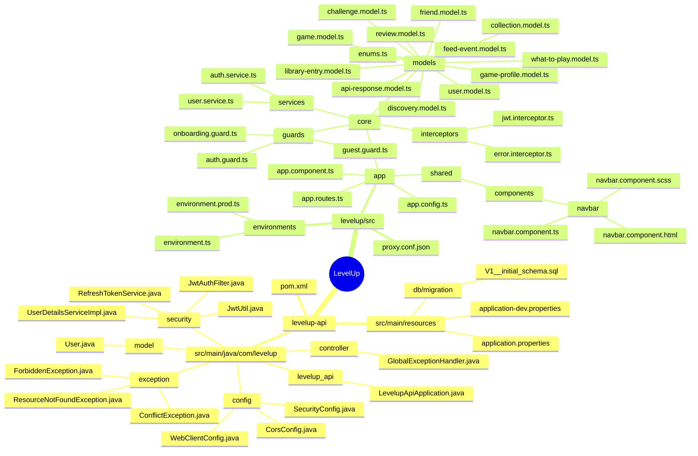

**Checkpoint:** Spring Boot starts without errors. `ng serve` runs with no console errors.

---

## Phase 1 — Authentication

> Register, login, logout, session restore.

### Files to add in Phase 1

**Backend:**

| File | Location |
| ------ | ---------- |
| `RefreshToken.java` | `com/levelup/model/` |
| `PasswordResetToken.java` | `com/levelup/model/` |
| `UserRepository.java` | `com/levelup/repository/` |
| `RefreshTokenRepository.java` | `com/levelup/repository/` |
| `PasswordResetTokenRepository.java` | `com/levelup/repository/` |
| `RegisterRequest.java` | `com/levelup/dto/request/` |
| `LoginRequest.java` | `com/levelup/dto/request/` |
| `AuthResponse.java` | `com/levelup/dto/response/` |
| `UserResponse.java` | `com/levelup/dto/response/` |
| `ErrorResponse.java` | `com/levelup/dto/response/` |
| `AuthService.java` | `com/levelup/service/` |
| `AuthController.java` | `com/levelup/controller/` |
| `UserController.java` _(stub)_ | `com/levelup/controller/` |

**Frontend:**

| File | Location |
| ------ | ---------- |
| `landing-page` component | `levelup/src/app/features/auth/landing-page/` |
| `login-page` component | `levelup/src/app/features/auth/login-page/` |
| `register-page` component | `levelup/src/app/features/auth/register-page/` |
| `forgot-password-page` component | `levelup/src/app/features/auth/forgot-password-page/` |
| Guards updated with real logic | `levelup/src/app/core/guards/` |
| `auth.service.ts` completed | `levelup/src/app/core/services/` |
| `user.service.ts` completed | `levelup/src/app/core/services/` |

### Structure after Phase 1

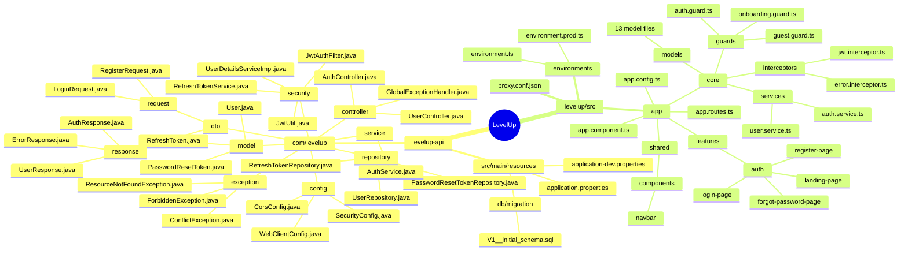

**Checkpoint:** Register creates a user. Login returns a token. Protected routes redirect to `/login`. Reload without being logged out.

---

## Phase 2 — Game Search (IGDB)

> Enables every feature that involves finding a game.

### Files to add in Phase 2

**Backend:**

| File | Location |
| ------ | ---------- |
| `Game.java` | `com/levelup/model/` |
| `GameRepository.java` | `com/levelup/repository/` |
| `GameSummaryResponse.java` | `com/levelup/dto/response/` |
| `GameResponse.java` | `com/levelup/dto/response/` |
| `GameService.java` | `com/levelup/service/` |
| `IgdbTokenService.java` | `com/levelup/service/` |
| `IgdbTokenRefreshScheduler.java` | `com/levelup/scheduler/` |
| `GameController.java` | `com/levelup/controller/` |
| New migration for `games` table _(if V1 already applied)_ | `db/migration/V2__add_games.sql` |

**Frontend:**

| File | Location |
| ------ | ---------- |
| `game.service.ts` | `levelup/src/app/core/services/` |
| `game-search-input` component | `levelup/src/app/shared/components/game-search-input/` |
| `game-card` component | `levelup/src/app/shared/components/game-card/` |

### Structure after Phase 2

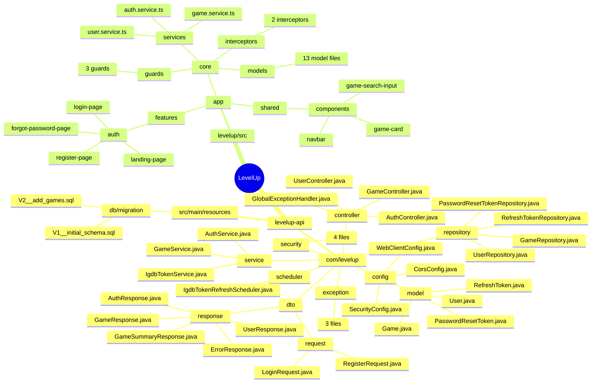

**Checkpoint:** Postman search returns IGDB results. Second search returns cached results.

---

## Phase 3 — Library

> The core feature. Also creates `FeedEvent` now — you need historical data for the feed later.

### Files to add in Phase 3

**Backend:**

| File | Location |
| ------ | ---------- |
| `LibraryStatus.java` | `com/levelup/model/enums/` |
| `FeedEventType.java` | `com/levelup/model/enums/` |
| `LibraryEntry.java` | `com/levelup/model/` |
| `FeedEvent.java` | `com/levelup/model/` |
| `LibraryEntryRepository.java` | `com/levelup/repository/` |
| `FeedEventRepository.java` | `com/levelup/repository/` |
| `CreateLibraryEntryRequest.java` | `com/levelup/dto/request/` |
| `UpdateLibraryEntryRequest.java` | `com/levelup/dto/request/` |
| `LibraryEntryResponse.java` | `com/levelup/dto/response/` |
| `FeedEventResponse.java` | `com/levelup/dto/response/` |
| `LibraryService.java` | `com/levelup/service/` |
| `LibraryController.java` | `com/levelup/controller/` |
| Migration for `library_entries` and `feed_events` tables | `db/migration/V3__add_library_and_feed.sql` |

**Frontend:**

| File | Location |
| ------ | ---------- |
| `library.service.ts` | `levelup/src/app/core/services/` |
| `library-page` component | `levelup/src/app/features/library/library-page/` |
| `library-toolbar` component | `levelup/src/app/features/library/library-toolbar/` |
| `library-grid` component | `levelup/src/app/features/library/library-grid/` |
| `game-detail-page` component | `levelup/src/app/features/library/game-detail-page/` |
| `user-game-actions` component | `levelup/src/app/features/library/game-detail-page/user-game-actions/` |
| `status-badge` component | `levelup/src/app/shared/components/status-badge/` |
| `status-picker` component | `levelup/src/app/shared/components/status-picker/` |
| `owned-toggle` component | `levelup/src/app/shared/components/owned-toggle/` |
| `rating-stars` component | `levelup/src/app/shared/components/rating-stars/` |

### Structure after Phase 3

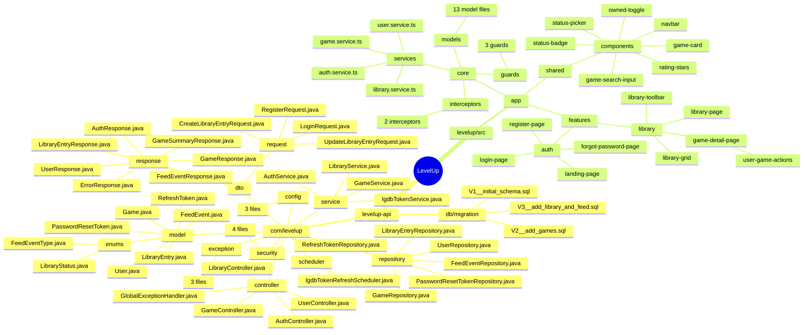

**Checkpoint:** Add a game to your library, change status, toggle owned, assign a rating. Feed events are written to the DB (check with a DB client).

---

## Phase 4 — User Profile

> Own profile page and taste profile. Friend-specific sections come in Phase 6.

### Files to add in Phase 4

**Backend:**

| File | Location |
| ------ | ---------- |
| `UpdateProfileRequest.java` | `com/levelup/dto/request/` |
| `UserSummaryResponse.java` | `com/levelup/dto/response/` |
| `TasteProfileResponse.java` | `com/levelup/dto/response/` |
| `UserService.java` | `com/levelup/service/` |
| `TasteProfileService.java` | `com/levelup/service/` |
| `UserController.java` updated with profile endpoints | `com/levelup/controller/` |

**Frontend:**

| File | Location |
| ------ | ---------- |
| `profile-page` component | `levelup/src/app/features/profile/profile-page/` |
| `profile-header` component | `levelup/src/app/features/profile/profile-page/profile-header/` |
| `taste-profile` component | `levelup/src/app/features/profile/profile-page/taste-profile/` |
| `recent-activity` component | `levelup/src/app/features/profile/profile-page/recent-activity/` |
| `collections-preview` component _(stub)_ | `levelup/src/app/features/profile/profile-page/collections-preview/` |
| `avatar` component | `levelup/src/app/shared/components/avatar/` |

### New additions — Phase 4

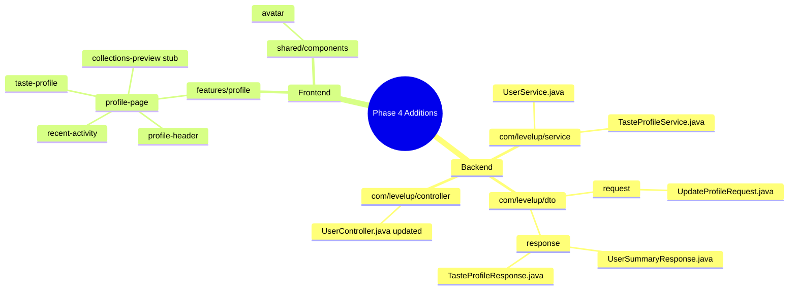

**Checkpoint:** `/profile/yourusername` shows your profile with taste profile data and recent activity.

---

## Phase 5 — Reviews & Comments

> The primary content unit of the social layer.

### Files to add in Phase 5

**Backend:**

| File | Location |
| ------ | ---------- |
| `Review.java` | `com/levelup/model/` |
| `ReviewComment.java` | `com/levelup/model/` |
| `ReviewLike.java` | `com/levelup/model/` |
| `CommentLike.java` | `com/levelup/model/` |
| `ReviewRepository.java` | `com/levelup/repository/` |
| `ReviewCommentRepository.java` | `com/levelup/repository/` |
| `ReviewLikeRepository.java` | `com/levelup/repository/` |
| `CommentLikeRepository.java` | `com/levelup/repository/` |
| `CreateReviewRequest.java` | `com/levelup/dto/request/` |
| `UpdateReviewRequest.java` | `com/levelup/dto/request/` |
| `CreateCommentRequest.java` | `com/levelup/dto/request/` |
| `ReviewResponse.java` | `com/levelup/dto/response/` |
| `CommentResponse.java` | `com/levelup/dto/response/` |
| `ReviewService.java` | `com/levelup/service/` |
| `CommentService.java` | `com/levelup/service/` |
| `ReviewController.java` | `com/levelup/controller/` |
| `CommentController.java` | `com/levelup/controller/` |
| Migration for `reviews`, `review_comments`, `review_likes`, `comment_likes` | `db/migration/V4__add_reviews.sql` |

**Frontend:**

| File | Location |
| ------ | ---------- |
| `review.service.ts` | `levelup/src/app/core/services/` |
| `comment.service.ts` | `levelup/src/app/core/services/` |
| `review-card` component | `levelup/src/app/shared/components/review-card/` |
| `game-reviews` component | `levelup/src/app/features/library/game-detail-page/game-reviews/` |
| `review-detail-page` component | `levelup/src/app/features/review/review-detail-page/` |
| `review-body` component | `levelup/src/app/features/review/review-detail-page/review-body/` |
| `review-comments` component | `levelup/src/app/features/review/review-detail-page/review-comments/` |

### New additions — Phase 5

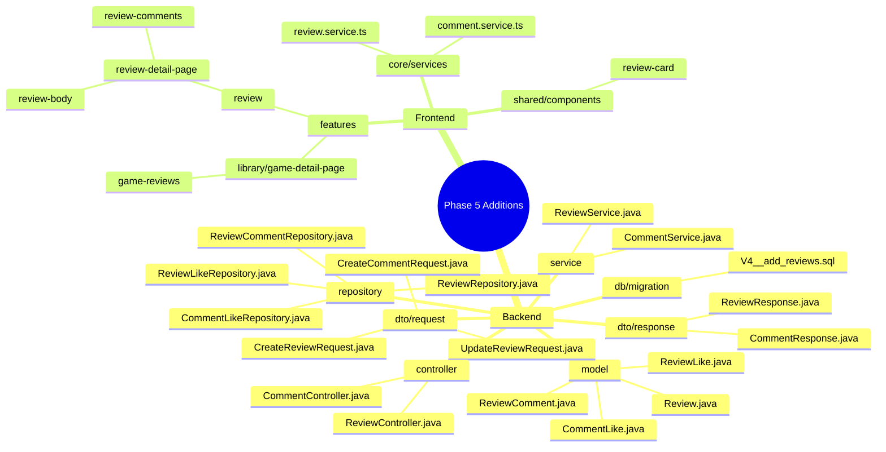

**Checkpoint:** Write a review from a game's detail page. View the full review with comments at `/reviews/:id`. Like a review.

---

## Phase 6 — Friends

> Social backbone. Unlocks profile visibility layers and shared library views.

### Files to add in Phase 6

**Backend:**

| File | Location |
| ------ | ---------- |
| `FriendshipStatus.java` | `com/levelup/model/enums/` |
| `FriendRequest.java` | `com/levelup/model/` |
| `Friendship.java` | `com/levelup/model/` |
| `FriendRequestRepository.java` | `com/levelup/repository/` |
| `FriendshipRepository.java` | `com/levelup/repository/` |
| `SendFriendRequestRequest.java` | `com/levelup/dto/request/` |
| `RespondToFriendRequestRequest.java` | `com/levelup/dto/request/` |
| `FriendshipResponse.java` | `com/levelup/dto/response/` |
| `FriendService.java` | `com/levelup/service/` |
| `FriendController.java` | `com/levelup/controller/` |
| `UserController.java` updated with search endpoint | `com/levelup/controller/` |
| Migration for `friend_requests`, `friendships` | `db/migration/V5__add_friends.sql` |

**Frontend:**

| File | Location |
| ------ | ---------- |
| `friend.service.ts` | `levelup/src/app/core/services/` |
| `friends-page` component | `levelup/src/app/features/friends/friends-page/` |
| `friend-list` component | `levelup/src/app/features/friends/friends-page/friend-list/` |
| `pending-requests` component | `levelup/src/app/features/friends/friends-page/pending-requests/` |
| `find-friends` component | `levelup/src/app/features/friends/friends-page/find-friends/` |
| `user-card` component | `levelup/src/app/shared/components/user-card/` |
| `friend-library` component | `levelup/src/app/features/profile/profile-page/friend-library/` |
| `shared-games` component | `levelup/src/app/features/profile/profile-page/shared-games/` |
| `friend-ratings` component | `levelup/src/app/features/library/game-detail-page/friend-ratings/` |

### New additions — Phase 6

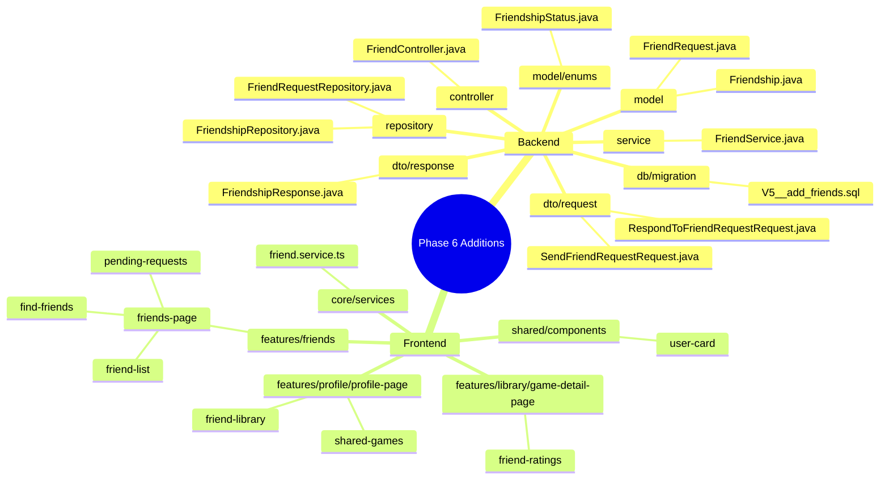

**Checkpoint:** Send a friend request, accept from another account, see friend-only profile sections.

---

## Phase 7 — Feed & Landing Page

> Home screen and the main retention loop.

### Files to add in Phase 7

**Backend:**

| File | Location |
| ------ | ---------- |
| `FeedService.java` | `com/levelup/service/` |
| `FeedController.java` | `com/levelup/controller/` |
| `FeedEventCleanupScheduler.java` | `com/levelup/scheduler/` |

**Frontend:**

| File | Location |
| ------ | ---------- |
| `feed.service.ts` | `levelup/src/app/core/services/` |
| `toast.service.ts` | `levelup/src/app/core/services/` |
| `feed-page` component | `levelup/src/app/features/discover/feed-page/` |
| `feed-view-switcher` component | `levelup/src/app/features/discover/feed-view-switcher/` |
| `friends-feed` component | `levelup/src/app/features/discover/friends-feed/` |
| `trending-feed` component | `levelup/src/app/features/discover/trending-feed/` |
| `landing-page` component _(properly built)_ | `levelup/src/app/features/auth/landing-page/` |
| `feed-item` component | `levelup/src/app/shared/components/feed-item/` |
| `toast` component | `levelup/src/app/shared/components/toast/` |

### New additions — Phase 7

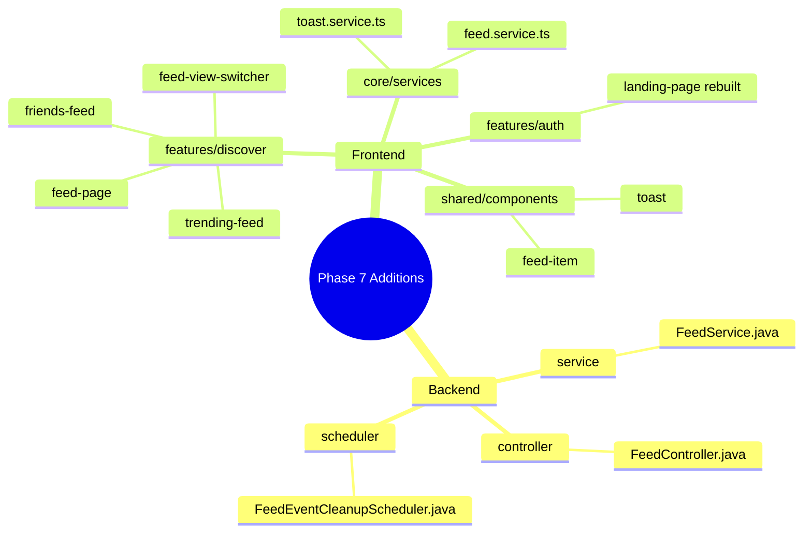

**Checkpoint:** `/feed` shows real friend activity and trending games. Landing page works for logged-out visitors.

---

## Phase 8 — Collections

> User-curated game lists. Self-contained — no hard deps beyond auth and library.

### Files to add in Phase 8

**Backend:**

| File | Location |
| ------ | ---------- |
| `VisibilityType.java` | `com/levelup/model/enums/` |
| `Collection.java` | `com/levelup/model/` |
| `CollectionEntry.java` | `com/levelup/model/` |
| `CollectionRepository.java` | `com/levelup/repository/` |
| `CollectionEntryRepository.java` | `com/levelup/repository/` |
| `CreateCollectionRequest.java` | `com/levelup/dto/request/` |
| `UpdateCollectionRequest.java` | `com/levelup/dto/request/` |
| `AddGameToCollectionRequest.java` | `com/levelup/dto/request/` |
| `CollectionResponse.java` | `com/levelup/dto/response/` |
| `CollectionSummaryResponse.java` | `com/levelup/dto/response/` |
| `CollectionService.java` | `com/levelup/service/` |
| `CollectionController.java` | `com/levelup/controller/` |
| Migration for `collections`, `collection_entries` | `db/migration/V6__add_collections.sql` |

**Frontend:**

| File | Location |
| ------ | ---------- |
| `collection.service.ts` | `levelup/src/app/core/services/` |
| `collection-detail-page` component | `levelup/src/app/features/collections/collection-detail-page/` |
| `collection-header` component | `levelup/src/app/features/collections/collection-detail-page/collection-header/` |
| `collection-grid` component | `levelup/src/app/features/collections/collection-detail-page/collection-grid/` |
| `collections-preview` updated with real data | `levelup/src/app/features/profile/profile-page/collections-preview/` |

### New additions — Phase 8

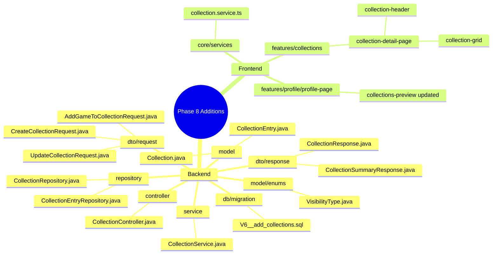

**Checkpoint:** Create a collection, add games, make it public, view it at `/collections/:id`.

---

## Phase 9 — Discovery Feeds

> Completes the feed tabs: For You, Similar, New & Notable.

### Files to add in Phase 9

**Backend:**

| File | Location |
| ------ | ---------- |
| `DiscoveryService.java` | `com/levelup/service/` |
| `DiscoveryController.java` | `com/levelup/controller/` |

**Frontend:**

| File | Location |
| ------ | ---------- |
| `discovery.service.ts` | `levelup/src/app/core/services/` |
| `for-you-feed` component | `levelup/src/app/features/discover/for-you-feed/` |
| `similar-feed` component | `levelup/src/app/features/discover/similar-feed/` |
| `new-notable-feed` component | `levelup/src/app/features/discover/new-notable-feed/` |

### New additions — Phase 9

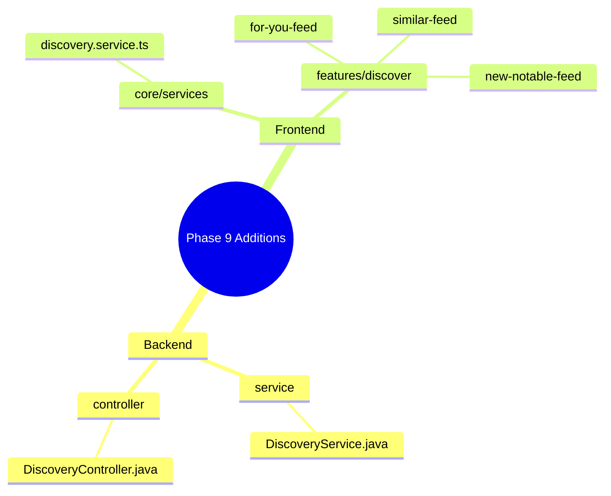

**Checkpoint:** All five feed tabs (Trending, Friends, For You, Similar, New & Notable) show real data.

---

## Phase 10 — What to Play Next

> Conversational recommendation from the user's own backlog.

### Files to add in Phase 10

**Backend:**

| File | Location |
| ------ | ---------- |
| `WhatToPlayRequest.java` | `com/levelup/dto/request/` |
| `WhatToPlayResponse.java` | `com/levelup/dto/response/` |
| `WhatToPlayService.java` | `com/levelup/service/` |
| `WhatToPlayController.java` | `com/levelup/controller/` |

**Frontend:**

| File | Location |
| ------ | ---------- |
| `what-to-play-page` component | `levelup/src/app/features/what-to-play/what-to-play-page/` |
| `prompt-step` component | `levelup/src/app/features/what-to-play/what-to-play-page/prompt-step/` |
| `suggestions-result` component | `levelup/src/app/features/what-to-play/what-to-play-page/suggestions-result/` |

### New additions — Phase 10

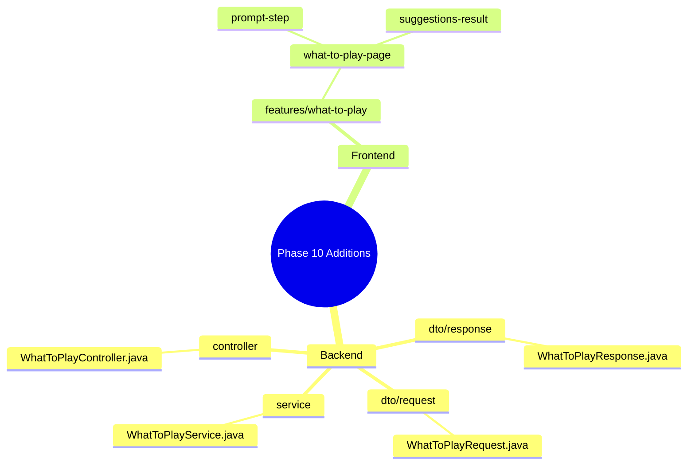

**Checkpoint:** Complete the prompt flow and receive a ranked shortlist from your actual backlog.

---

## Phase 11 — Daily Challenge

> Most complex feature. Everything else must be working first.

### Files to add in Phase 11

**Backend:**

| File | Location |
| ------ | ---------- |
| `DailyChallenge.java` | `com/levelup/model/` |
| `DailyChallengeResult.java` | `com/levelup/model/` |
| `DailyChallengeRepository.java` | `com/levelup/repository/` |
| `DailyChallengeResultRepository.java` | `com/levelup/repository/` |
| `ChallengeResponse.java` | `com/levelup/dto/response/` |
| `ChallengeResultResponse.java` | `com/levelup/dto/response/` |
| `ChallengeService.java` | `com/levelup/service/` |
| `ChallengeController.java` | `com/levelup/controller/` |
| `DailyChallengeScheduler.java` | `com/levelup/scheduler/` |
| Migration for `daily_challenges`, `daily_challenge_results` | `db/migration/V7__add_challenges.sql` |

**Frontend:**

| File | Location |
| ------ | ---------- |
| `challenge.service.ts` | `levelup/src/app/core/services/` |
| `challenge-page` component | `levelup/src/app/features/daily-challenge/challenge-page/` |
| `challenge-active` component | `levelup/src/app/features/daily-challenge/challenge-page/challenge-active/` |
| `challenge-result` component | `levelup/src/app/features/daily-challenge/challenge-page/challenge-result/` |
| `friend-scores` component | `levelup/src/app/features/daily-challenge/challenge-page/friend-scores/` |
| `challenge-history` component | `levelup/src/app/features/profile/profile-page/challenge-history/` |

### New additions — Phase 11

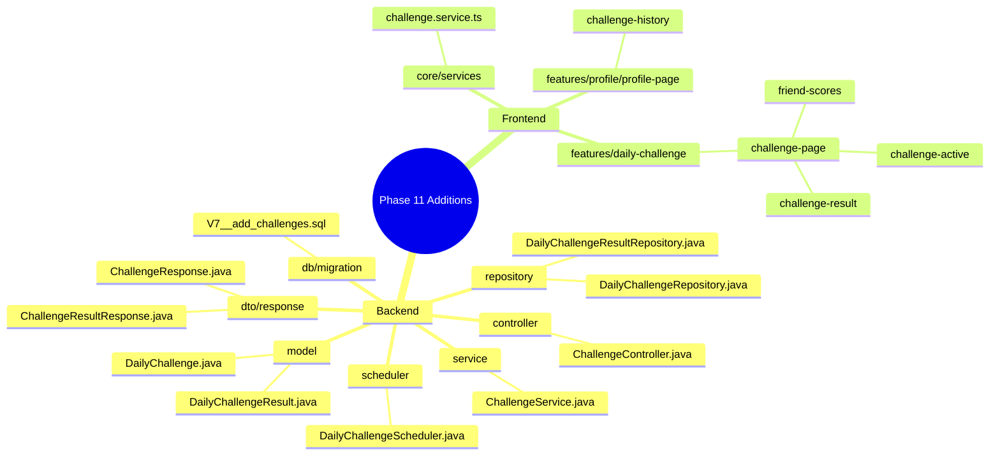

**Checkpoint:** A challenge exists for today. Complete it, see score reveal, view friend scores, see your streak on profile.

---

## Phase 12 — Onboarding, Settings & Polish

> Do not start until the core features are working end-to-end.

### Files to add in Phase 12

**Backend:**

| File | Location |
| ------ | ---------- |
| `GameProfile.java` | `com/levelup/model/` |
| `GameProfileRepository.java` | `com/levelup/repository/` |
| `UpdateSettingsRequest.java` | `com/levelup/dto/request/` |
| `DeleteAccountRequest.java` | `com/levelup/dto/request/` |
| `CreateGameProfileRequest.java` | `com/levelup/dto/request/` |
| `GameProfileResponse.java` | `com/levelup/dto/response/` |
| `SharedGameResponse.java` | `com/levelup/dto/response/` |
| `SettingsController.java` | `com/levelup/controller/` |
| `AccountPurgeScheduler.java` | `com/levelup/scheduler/` |
| Migration for `game_profiles` | `db/migration/V8__add_settings.sql` |

**Frontend:**

| File | Location |
| ------ | ---------- |
| `onboarding-page` component | `levelup/src/app/features/auth/onboarding-page/` |
| `onboarding-search-step` component | `levelup/src/app/features/auth/onboarding-page/onboarding-search-step/` |
| `onboarding-prefs-step` component | `levelup/src/app/features/auth/onboarding-page/onboarding-prefs-step/` |
| `settings-page` component | `levelup/src/app/features/settings/settings-page/` |
| `account-settings` component | `levelup/src/app/features/settings/account-settings/` |
| `privacy-settings` component | `levelup/src/app/features/settings/privacy-settings/` |
| `game-profiles` component | `levelup/src/app/features/settings/game-profiles/` |
| `danger-zone` component | `levelup/src/app/features/settings/danger-zone/` |
| `loading-skeleton` component | `levelup/src/app/shared/components/loading-skeleton/` |
| `empty-state` component | `levelup/src/app/shared/components/empty-state/` |
| `confirm-dialog` component | `levelup/src/app/shared/components/confirm-dialog/` |
| `time-ago.pipe.ts` | `levelup/src/app/shared/pipes/` |
| `truncate.pipe.ts` | `levelup/src/app/shared/pipes/` |
| `status-label.pipe.ts` | `levelup/src/app/shared/pipes/` |
| `not-found-page` component | `levelup/src/app/features/not-found/` |
| `onboarding.guard.ts` completed | `levelup/src/app/core/guards/` |

### New additions — Phase 12

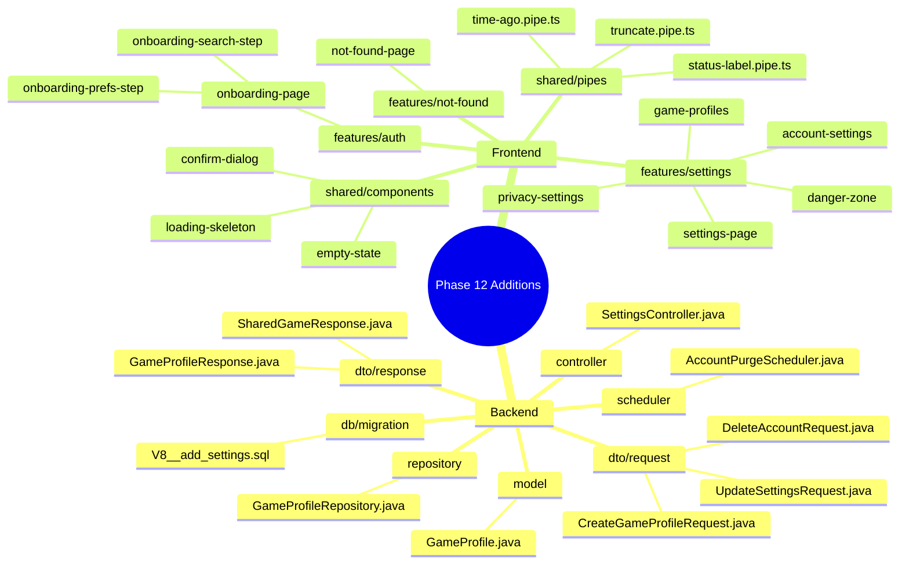

**Checkpoint:** New users go through onboarding. Existing users can update settings and delete their account. Every page handles loading and empty states.

---

## Complete Final Structure

Full backend package tree after all phases:

```text
levelup-api/src/main/java/com/levelup/
├── levelup_api/
│   └── LevelupApiApplication.java
├── config/
│   ├── SecurityConfig.java
│   ├── CorsConfig.java
│   └── WebClientConfig.java
├── security/
│   ├── JwtUtil.java
│   ├── JwtAuthFilter.java
│   ├── RefreshTokenService.java
│   └── UserDetailsServiceImpl.java
├── exception/
│   ├── ResourceNotFoundException.java
│   ├── ConflictException.java
│   └── ForbiddenException.java
├── model/
│   ├── User.java
│   ├── Game.java
│   ├── LibraryEntry.java
│   ├── Review.java
│   ├── ReviewComment.java
│   ├── ReviewLike.java
│   ├── CommentLike.java
│   ├── FriendRequest.java
│   ├── Friendship.java
│   ├── RefreshToken.java
│   ├── PasswordResetToken.java
│   ├── FeedEvent.java
│   ├── Collection.java
│   ├── CollectionEntry.java
│   ├── DailyChallenge.java
│   ├── DailyChallengeResult.java
│   ├── GameProfile.java
│   └── enums/
│       ├── LibraryStatus.java
│       ├── FriendshipStatus.java
│       ├── FeedEventType.java
│       └── VisibilityType.java
├── repository/
│   ├── UserRepository.java
│   ├── GameRepository.java
│   ├── LibraryEntryRepository.java
│   ├── ReviewRepository.java
│   ├── ReviewCommentRepository.java
│   ├── ReviewLikeRepository.java
│   ├── CommentLikeRepository.java
│   ├── FriendRequestRepository.java
│   ├── FriendshipRepository.java
│   ├── FeedEventRepository.java
│   ├── CollectionRepository.java
│   ├── CollectionEntryRepository.java
│   ├── DailyChallengeRepository.java
│   ├── DailyChallengeResultRepository.java
│   ├── RefreshTokenRepository.java
│   ├── PasswordResetTokenRepository.java
│   └── GameProfileRepository.java
├── dto/
│   ├── request/
│   │   ├── RegisterRequest.java
│   │   ├── LoginRequest.java
│   │   ├── UpdateProfileRequest.java
│   │   ├── CreateLibraryEntryRequest.java
│   │   ├── UpdateLibraryEntryRequest.java
│   │   ├── CreateReviewRequest.java
│   │   ├── UpdateReviewRequest.java
│   │   ├── CreateCommentRequest.java
│   │   ├── SendFriendRequestRequest.java
│   │   ├── RespondToFriendRequestRequest.java
│   │   ├── CreateCollectionRequest.java
│   │   ├── UpdateCollectionRequest.java
│   │   ├── AddGameToCollectionRequest.java
│   │   ├── WhatToPlayRequest.java
│   │   ├── UpdateSettingsRequest.java
│   │   ├── DeleteAccountRequest.java
│   │   └── CreateGameProfileRequest.java
│   └── response/
│       ├── AuthResponse.java
│       ├── UserResponse.java
│       ├── UserSummaryResponse.java
│       ├── GameResponse.java
│       ├── GameSummaryResponse.java
│       ├── LibraryEntryResponse.java
│       ├── ReviewResponse.java
│       ├── CommentResponse.java
│       ├── FriendshipResponse.java
│       ├── FeedEventResponse.java
│       ├── CollectionResponse.java
│       ├── CollectionSummaryResponse.java
│       ├── SharedGameResponse.java
│       ├── TasteProfileResponse.java
│       ├── WhatToPlayResponse.java
│       ├── ChallengeResponse.java
│       ├── ChallengeResultResponse.java
│       ├── ErrorResponse.java
│       └── GameProfileResponse.java
├── service/
│   ├── AuthService.java
│   ├── UserService.java
│   ├── GameService.java
│   ├── LibraryService.java
│   ├── ReviewService.java
│   ├── CommentService.java
│   ├── FriendService.java
│   ├── FeedService.java
│   ├── DiscoveryService.java
│   ├── CollectionService.java
│   ├── WhatToPlayService.java
│   ├── ChallengeService.java
│   ├── TasteProfileService.java
│   └── IgdbTokenService.java
├── controller/
│   ├── GlobalExceptionHandler.java
│   ├── AuthController.java
│   ├── UserController.java
│   ├── GameController.java
│   ├── LibraryController.java
│   ├── ReviewController.java
│   ├── CommentController.java
│   ├── FriendController.java
│   ├── FeedController.java
│   ├── DiscoveryController.java
│   ├── CollectionController.java
│   ├── WhatToPlayController.java
│   ├── ChallengeController.java
│   └── SettingsController.java
└── scheduler/
    ├── DailyChallengeScheduler.java
    ├── IgdbTokenRefreshScheduler.java
    ├── FeedEventCleanupScheduler.java
    └── AccountPurgeScheduler.java
```

Full frontend tree after all phases:

```text
levelup/src/
├── environments/
│   ├── environment.ts
│   └── environment.prod.ts
├── proxy.conf.json
├── index.html
├── main.ts
├── styles.scss
└── app/
    ├── app.component.ts/.html/.scss
    ├── app.config.ts
    ├── app.routes.ts
    ├── core/
    │   ├── guards/
    │   │   ├── auth.guard.ts
    │   │   ├── guest.guard.ts
    │   │   └── onboarding.guard.ts
    │   ├── interceptors/
    │   │   ├── jwt.interceptor.ts
    │   │   └── error.interceptor.ts
    │   ├── services/
    │   │   ├── auth.service.ts
    │   │   ├── user.service.ts
    │   │   ├── game.service.ts
    │   │   ├── library.service.ts
    │   │   ├── review.service.ts
    │   │   ├── comment.service.ts
    │   │   ├── friend.service.ts
    │   │   ├── feed.service.ts
    │   │   ├── discovery.service.ts
    │   │   ├── collection.service.ts
    │   │   ├── challenge.service.ts
    │   │   ├── taste-profile.service.ts
    │   │   └── toast.service.ts
    │   └── models/
    │       ├── user.model.ts
    │       ├── game.model.ts
    │       ├── game-profile.model.ts
    │       ├── library-entry.model.ts
    │       ├── review.model.ts
    │       ├── friend.model.ts
    │       ├── feed-event.model.ts
    │       ├── collection.model.ts
    │       ├── challenge.model.ts
    │       ├── discovery.model.ts
    │       ├── what-to-play.model.ts
    │       ├── api-response.model.ts
    │       └── enums.ts
    ├── features/
    │   ├── auth/
    │   │   ├── landing-page/
    │   │   ├── login-page/
    │   │   ├── register-page/
    │   │   ├── forgot-password-page/
    │   │   └── onboarding-page/
    │   │       ├── onboarding-search-step/
    │   │       └── onboarding-prefs-step/
    │   ├── discover/
    │   │   ├── feed-page/
    │   │   ├── feed-view-switcher/
    │   │   ├── trending-feed/
    │   │   ├── friends-feed/
    │   │   ├── for-you-feed/
    │   │   ├── similar-feed/
    │   │   └── new-notable-feed/
    │   ├── library/
    │   │   ├── library-page/
    │   │   ├── library-toolbar/
    │   │   ├── library-grid/
    │   │   └── game-detail-page/
    │   │       ├── user-game-actions/
    │   │       ├── friend-ratings/
    │   │       └── game-reviews/
    │   ├── review/
    │   │   └── review-detail-page/
    │   │       ├── review-body/
    │   │       └── review-comments/
    │   ├── friends/
    │   │   └── friends-page/
    │   │       ├── friend-list/
    │   │       ├── pending-requests/
    │   │       └── find-friends/
    │   ├── profile/
    │   │   └── profile-page/
    │   │       ├── profile-header/
    │   │       ├── taste-profile/
    │   │       ├── recent-activity/
    │   │       ├── collections-preview/
    │   │       ├── challenge-history/
    │   │       ├── friend-library/
    │   │       └── shared-games/
    │   ├── collections/
    │   │   └── collection-detail-page/
    │   │       ├── collection-header/
    │   │       └── collection-grid/
    │   ├── what-to-play/
    │   │   └── what-to-play-page/
    │   │       ├── prompt-step/
    │   │       └── suggestions-result/
    │   ├── daily-challenge/
    │   │   └── challenge-page/
    │   │       ├── challenge-active/
    │   │       ├── challenge-result/
    │   │       └── friend-scores/
    │   ├── settings/
    │   │   ├── settings-page/
    │   │   ├── account-settings/
    │   │   ├── privacy-settings/
    │   │   ├── game-profiles/
    │   │   └── danger-zone/
    │   └── not-found/
    │       └── not-found-page.component.ts
    └── shared/
        ├── components/
        │   ├── navbar/
        │   ├── game-card/
        │   ├── game-search-input/
        │   ├── status-badge/
        │   ├── status-picker/
        │   ├── owned-toggle/
        │   ├── rating-stars/
        │   ├── avatar/
        │   ├── user-card/
        │   ├── review-card/
        │   ├── feed-item/
        │   ├── empty-state/
        │   ├── loading-skeleton/
        │   ├── confirm-dialog/
        │   └── toast/
        └── pipes/
            ├── time-ago.pipe.ts
            ├── truncate.pipe.ts
            └── status-label.pipe.ts
```
